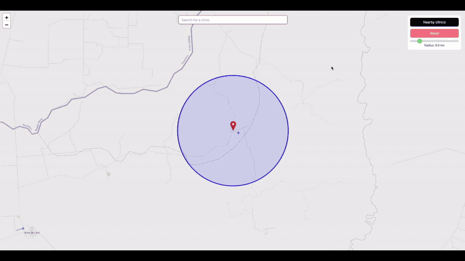

# PostGIS Map

This is a PostGIS demo web application. The development environment is fully containerized using [Docker](https://www.docker.com/products/docker-desktop/) and Laravel Sail.



## Key Technologies

- **[clickbar/laravel-magellan](https://github.com/clickbar/laravel-magellan)**: This package provides access to PostGIS functionality within Laravel. It allows using PostGIS data types in migrations and provides Builder functions to access PostGIS functions, avoiding raw SQL.

## Getting Started

1.  **Prepare the environment file.**
    ```bash
    composer setup
    ```

2.  **Build and start the application containers.**
    ```bash
    sail build
    sail up -d
    ```
3.  **Connect to the database.**
    ```bash
    sail exec pgsql psql -U ${DB_USERNAME} -d ${DB_DATABASE}
    ```
    or
    ```bash
    sail exec pgsql psql -U sail -d postgis_demo
    ```

4.  **Activate PostGIS.**
    ```bash
    CREATE EXTENSION postgis;
    ```

5. **Start the frontend development server.**
    ```bash
    sail yarn dev
    ```

6. **Run migrations and seed data.**
    ```bash
    sail artisan migrate:fresh --seed
    ```

## Development Workflow

### IDE Helper

```bash
sail artisan ide-helper:generate
sail artisan ide-helper:models -RW
sail artisan ide-helper:meta
```

### Code Quality & Linting

- **Pint**: Fix code style issues.
  ```bash
  sail pint
  ```
- **PHPStan**: Run static analysis to find potential bugs.
  ```bash
  sail phpstan analyse
  ```
- **ESLint & Prettier**: Lint and format frontend code.
  ```bash
  sail yarn lint
  sail yarn format
  ```

### Testing

```bash
sail up -d
sail shell
make test
```
